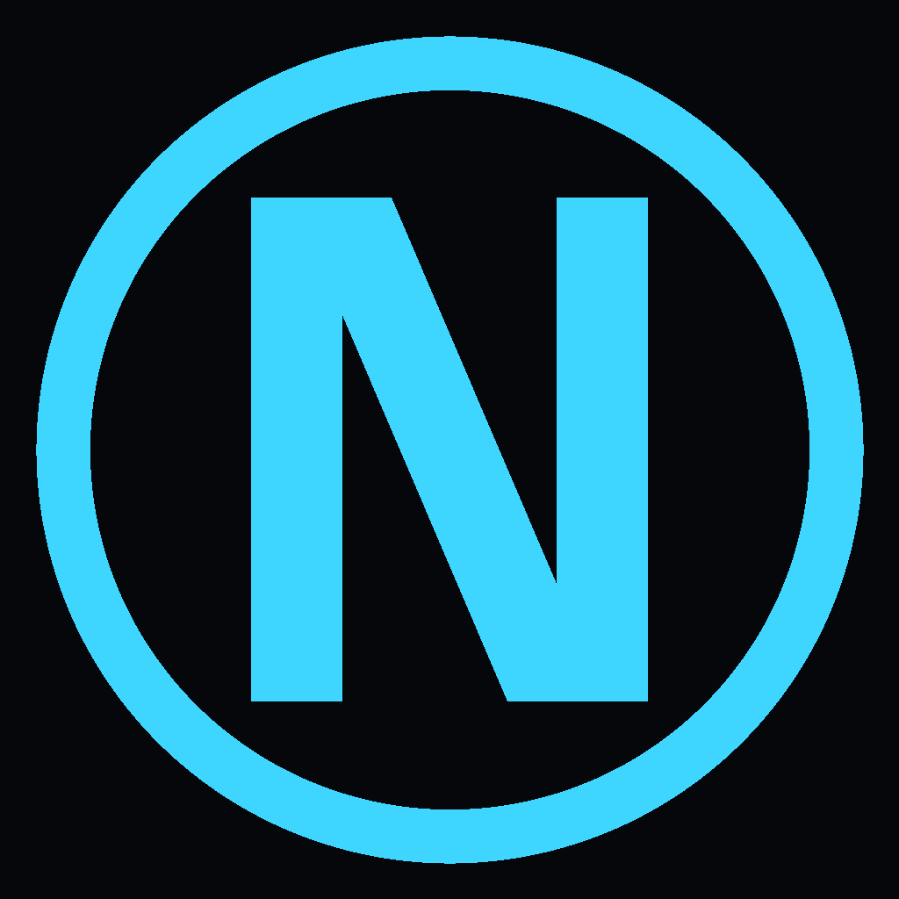
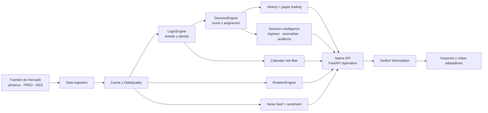

<div align="center">
  
  <h1>NEXUS Workstation</h1>
  <p><strong>Market intelligence for disciplined decisions.</strong></p>
  <p>Workstation 3.0 · Native macOS interface · Python decision engine · Explainable market context</p>
</div>

<p align="center">
  <a href="#características">Características</a> ·
  <a href="#arquitectura">Arquitectura</a> ·
  <a href="#inicio-rápido">Inicio rápido</a> ·
  <a href="#desarrollo-y-pruebas">Pruebas</a>
</p>

## Sobre NEXUS

NEXUS es una workstation de análisis de mercado que combina ingestión de datos, filtros de riesgo, análisis técnico y macroeconómico, noticias y un motor de decisión explicable.

La aplicación está diseñada para responder tres preguntas:

1. ¿Qué contexto de mercado estamos observando?
2. ¿Qué factores están impulsando la lectura?
3. ¿Qué acción operativa es razonable y qué debería evitarse?

NEXUS no ejecuta operaciones reales ni sustituye asesoramiento financiero. Las señales, escenarios y simulaciones son herramientas de análisis.

## Características

### Interfaz nativa macOS

- Aplicación SwiftUI para macOS 14+.
- Navegación adaptativa para ventanas pequeñas y pantalla completa.
- Materiales de vibrancy nativos y tarjetas consistentes.
- Inspector de activos con score, tendencia, momentum y volatilidad.
- Lector interno de noticias con filtros de tono.

### Modos de análisis

- **Resumen**: decisión operativa, ranking, pulso macro y asignación.
- **Noticias**: fuentes, sentimiento, narrativas por tema y lectura contextual.
- **Historial**: cambios de decisión, score, precios y atribución entre snapshots.
- **Divisas y oro**: EUR/USD, USD/EUR, dólar, oro, momentum y catalizadores.
- **Rotación sectorial**: líderes, receptores de flujo, sectores neutrales y débiles.
- **Gráficos**: terminal multipanel con velas a demanda, cursor compartido y empresas en flujo.
- **Cartera virtual**: simulación, comparación con SPY, drawdown, concentración y escenarios.
- **Global**: regiones, VIX, tipos, liquidez, valoración y calidad de datos.
- **Informe**: lectura ejecutiva, factores del score, activos priorizados y cambios recientes.

### Inteligencia y calidad

- Clasificación descriptiva del régimen: expansión, transición, cautela o estrés.
- Anomalías de volatilidad, curva de tipos y momentum.
- Factores estructurados detrás de la decisión.
- Estado y calidad de las fuentes de datos.
- Hash de auditoría por snapshot.
- Track record histórico y resultados agrupados por señal operativa.

## Arquitectura



### Flujo de una evaluación

1. Se descargan o recuperan de caché precios, macro, divisas y noticias.
2. Cada dato recibe estado de calidad, fuente y contexto de actualización.
3. Los filtros de calendario y sentimiento determinan si existe riesgo operativo.
4. El motor calcula score, acción macro, acción operativa y asignación.
5. Se construyen rotación, historial, track record y cartera virtual.
6. La capa de inteligencia añade régimen, anomalías, narrativas y auditoría.
7. SwiftUI consume un snapshot estable mediante `GET /api/native`.

## Inicio rápido

### Requisitos

- macOS 14 o superior.
- Python 3.11+ recomendado.
- Swift 5.9+.
- Dependencias Python del proyecto.
- Opcional: `FRED_API_KEY` para datos macro adicionales.

### Preparar el entorno

```bash
git clone https://github.com/MarcOrtiz21/NEXUS.git
cd NEXUS
./setup.command
```

Si ya existe el entorno virtual:

```bash
.venv/bin/python -m pip install -r requirements.txt
.venv/bin/python -m pip install pytest
```

### Ejecutar la aplicación nativa

La forma recomendada en macOS es:

```bash
./scripts/run_native.command
```

También puede construirse e instalarse en Aplicaciones:

```bash
./scripts/install_mac_app.sh
open "/Applications/NEXUS Workstation.app"
```

## API nativa

El backend local se sirve en `http://127.0.0.1:8765`.

| Endpoint | Uso |
| --- | --- |
| `GET /api/native` | Snapshot completo para SwiftUI |
| `GET /api/native/refresh` | Actualiza y persiste un snapshot |
| `GET /api/health` | Estado del backend |

El payload incluye decisión, mercado, activos, noticias, calendario, historial, cartera virtual, track record, inteligencia derivada y auditoría.

## Desarrollo y pruebas

Compilar la interfaz SwiftUI:

```bash
swift build --package-path native
```

Ejecutar toda la suite Python:

```bash
.venv/bin/python -m pytest
```

Las pruebas cubren ingestión/cache, calendario, motor de decisión, historial, noticias, sentimiento, cartera virtual, track record y contrato del API nativo.

## Estructura del proyecto

```text
NEXUS/
├── native/                 # Aplicación SwiftUI y modelos del API
├── risk_filters/           # Calendario, noticias y sentimiento
├── data/                   # Datos locales y snapshots de ejecución
├── tests/                  # Suite de regresión Python
├── assets/                 # Icono y recursos de la aplicación
├── native_api.py           # Contrato FastAPI para la app nativa
├── decision_engine.py      # Score, acción y asignación
├── decision_intelligence.py# Régimen, anomalías y calidad
├── data_ingestion.py      # Mercado, macro, caché y procedencia
├── paper_trading.py       # Simulación de cartera
└── scripts/                # Build, instalación y ejecución
```

## Datos y limitaciones

- Los datos de mercado pueden proceder de caché cuando una fuente no está disponible.
- Las narrativas de noticias son agrupaciones heurísticas y no prueban causalidad.
- Los escenarios de cartera son aproximaciones mecánicas, no predicciones.
- El track record depende del número y frecuencia de snapshots históricos.
- Las claves y credenciales deben permanecer fuera del repositorio.

## Licencia

Uso privado y experimental. Define la licencia de distribución antes de publicar una versión pública.
